# DNAustria – User Guide

This guide gives a compact overview of how to use the DNAustria web app, covering the **Dashboard**, **Events**, **Contacts**, **Locations** (addresses), and **Organizations** modules.

---

## 1. Login & Navigation

After logging in, the app opens with the left-hand sidebar. Use it to switch between modules:

- **Dashboard** – overview
- **Events** – events
- **Contacts** – people / points of contact
- **Locations** – addresses / event venues
- **Organizations** – partner organizations
- **LLM Analyzer** – text analysis via AI

The currently signed-in user is shown at the bottom-left of the sidebar, together with a **Sign out** button.

---

## 2. Dashboard

The dashboard gives a quick overview of the current system data.

### 2.1 Overview

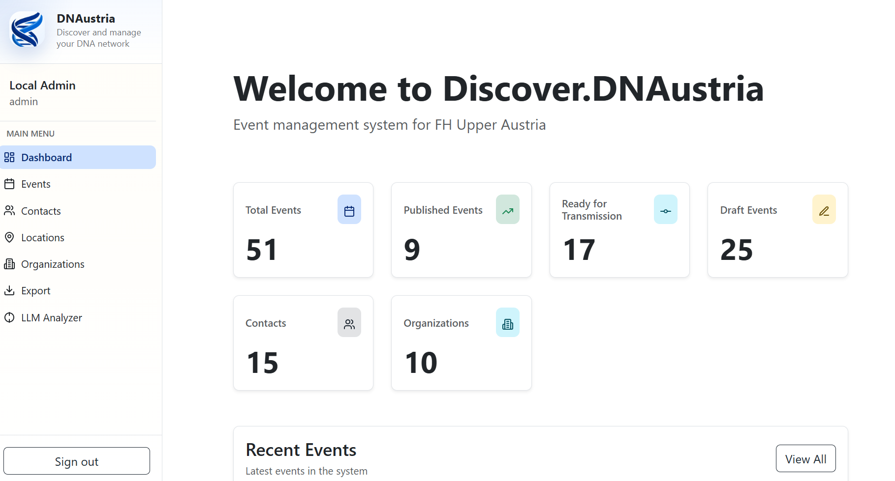

On this page, users can:

- See the total number of events
- View how many events are published
- View how many events are ready for transmission
- View how many events are still drafts
- See the number of contacts
- See the number of organizations

The dashboard tiles are clickable and act as shortcuts to the corresponding management pages:

- `Total Events` opens the full Events page
- `Published Events` opens the Events page filtered to published events
- `Ready for Transmission` opens the Events page filtered to events that are ready for transmission
- `Draft Events` opens the Events page filtered to draft events
- `Contacts` opens the Contacts page
- `Organizations` opens the Organizations page

This page is useful as a starting point because it summarizes the current state of the event database.

### 2.2 Recent Events

The lower section of the dashboard contains a list of the most recent events.

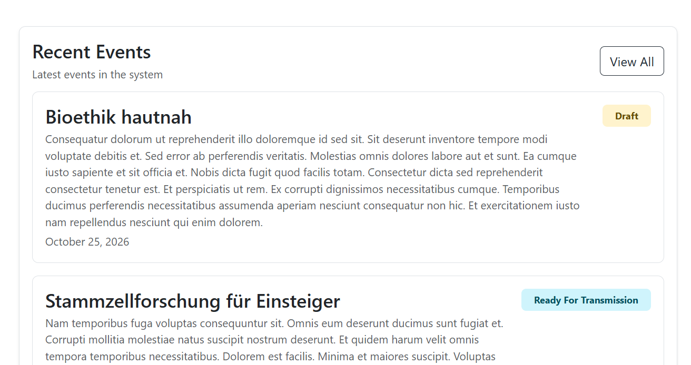

Each event card in this section shows:

- The event title
- A short preview of the description
- The event date
- The current status, for example `Draft` or `Ready For Transmission`

The `View All` button opens the complete event overview.

---

## 3. Events

### 3.1 Event Overview

The event overview is the central place for browsing and managing events.

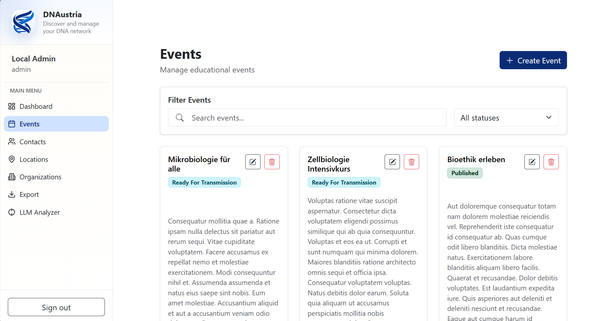

On this page, users can:

- Browse all available events
- Open the create dialog with `Create Event`
- Edit an event using the pencil icon
- Delete an event using the trash icon
- Review the current publication status directly on each event card

Each event card typically contains:

- The event title
- The current status badge
- A short text preview
- Action buttons for editing and deleting

### 3.2 Filtering Events

The `Filter Events` area helps users narrow down the result list.

#### 3.2.1 Search by Name

Users can type a keyword into the search field to find events by name.

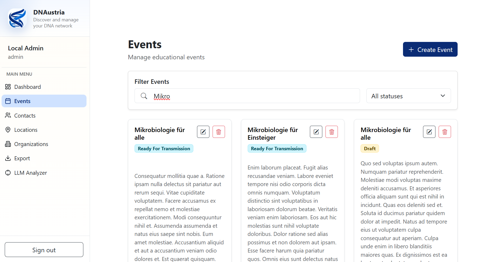

This is useful when looking for a specific event or a group of similarly named events.

#### 3.2.2 Filter by Status

Users can also filter the list by event status.

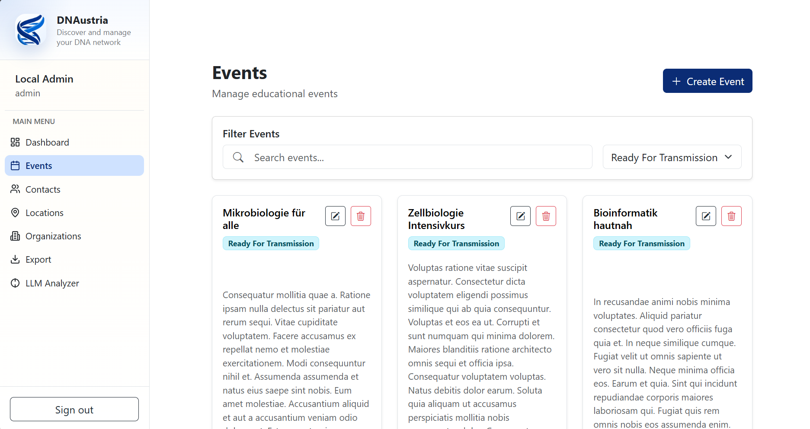

Example use cases:

- Show only draft events
- Show only published events
- Show only events ready for transmission

Name search and status filtering can be used together to reduce the list further.

### 3.3 Event Details

The event details page provides a complete view of a single event.

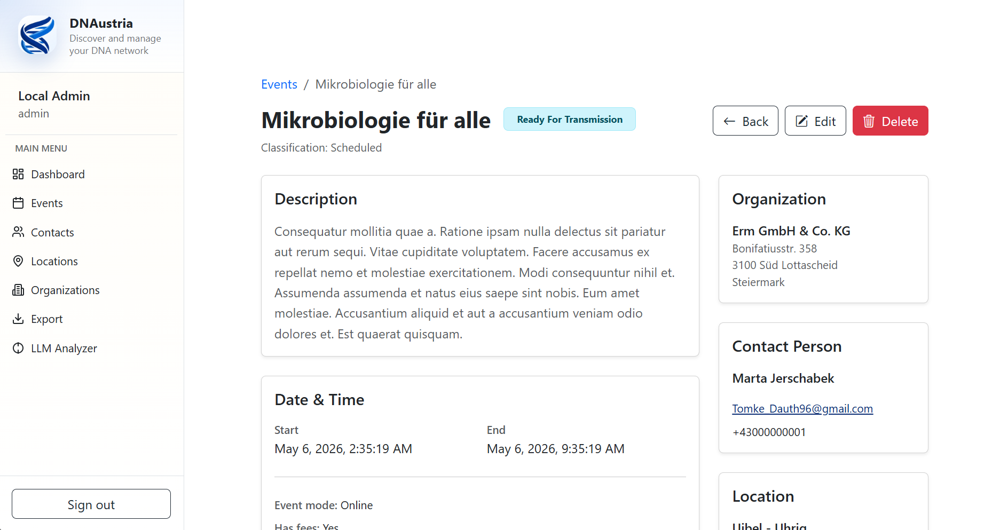

This page includes:

- Breadcrumb navigation back to the event overview
- The event title
- The current status
- The event classification
- A full description
- Start and end date/time
- Event mode, for example online or on-site
- Fee information
- Organization details
- Contact person details
- Location information

Users can also use the action buttons in the top-right area to:

- Go back to the overview
- Edit the event
- Delete the event

This screen is intended for reviewing event information in more detail before making changes.

### 3.4 Creating a New Event

Users can create a new event from the event overview by clicking `Create Event`.

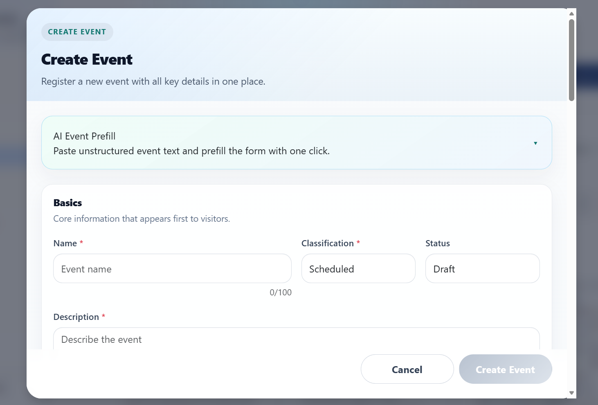

The event creation dialog contains structured sections, for example:

- AI Event Prefill
- Basics
- Additional event data further down in the form

In the visible part of the form, users can already enter:

- Event name
- Classification
- Status
- Description

Required fields are marked with an asterisk (`*`).

At the bottom of the dialog, users can:

- Cancel the creation process
- Save the new event with `Create Event`

### 3.5 AI Event Prefill

The create dialog also includes an `AI Event Prefill` section.

This feature allows users to paste unstructured event information and use AI support to prefill the form automatically. This can save time when event data already exists in free-text form, such as copied announcements or descriptions.

---

## 4. Contacts

Use this module to manage all people who participate in events or are linked to organizations.

### 4.1 Overview

Click **Contacts** in the menu. A card view of all contacts is displayed, showing name, email, phone number, and the assigned organization.

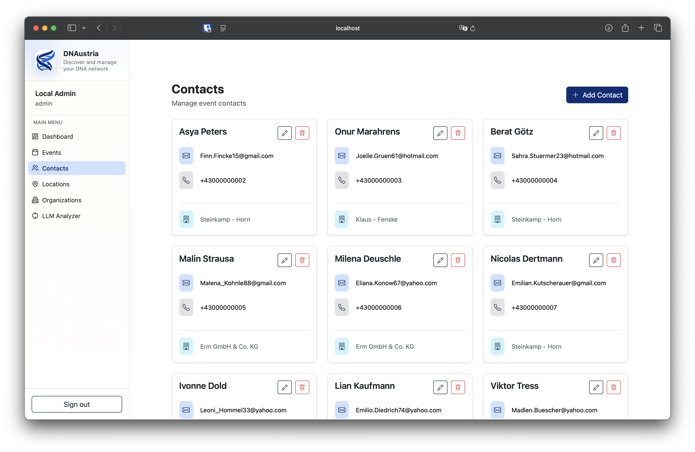

Each card offers two actions:

- ✏️ **Edit** – opens the edit popup
- 🗑️ **Delete** – removes the contact after confirmation

### 4.2 Create a contact

1. Click **+ Add Contact** in the top-right corner.
2. Fill in the popup form:
   - **Name** (required)
   - **Email** *or* **Phone** – at least one of the two must be provided
   - **Organization** – optional assignment to an existing organization (dropdown)
3. Click **Create Contact** to save, or **Cancel** to discard.

### 4.3 Edit / delete a contact

- **Edit:** click the ✏️ icon on the card → change fields in the popup → **Save Changes**.
- **Delete:** click the 🗑️ icon on the card → confirm the safety prompt.

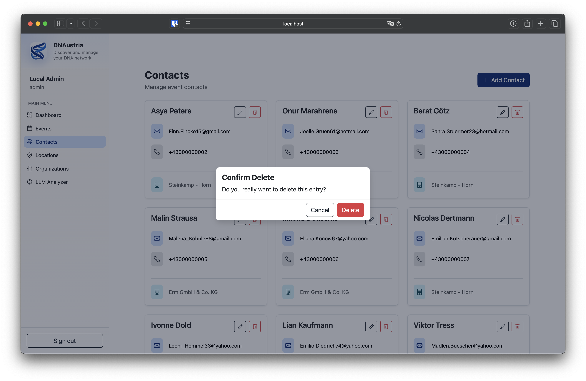

> Tip: Email and phone formats are validated automatically. Error messages appear directly below the relevant input field.

---

## 5. Locations

Locations are physical places (addresses with geo-coordinates) that can be assigned to events and organizations.

### 5.1 Overview

Open **Locations** in the menu. Each card shows the title, latitude/longitude, and the full address (street, zip, city, state).

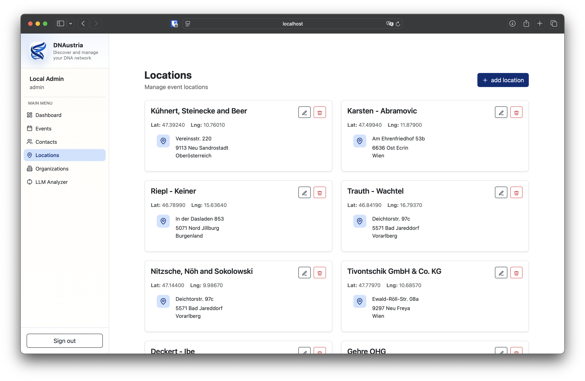

### 5.2 Create a location

1. Click **+ add location**.
2. **Basic Information:**
   - **Title** (required) – a meaningful name (e.g. "Conference Center Linz").
3. **Latitude & Longitude:**
   - Click directly on the map to set the pin (and thereby the coordinates), or
   - Enter latitude/longitude manually.

   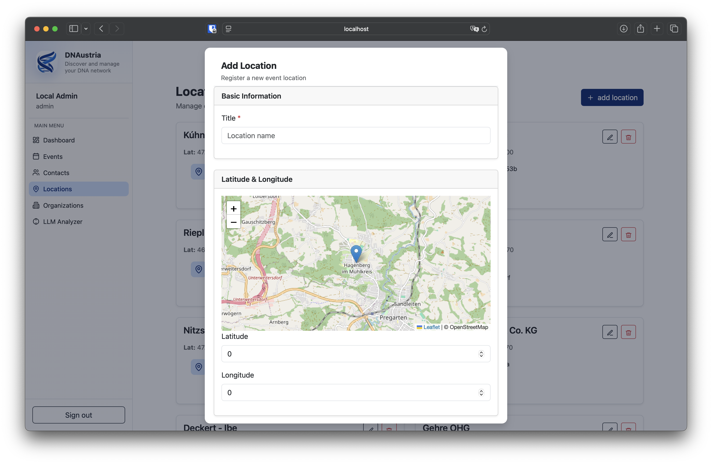

4. **Address** (all fields marked with \* are required):
   - **Street** – street and house number
   - **Zip** – postal code
   - **City** – city or town
   - **State** – select the state from the dropdown

   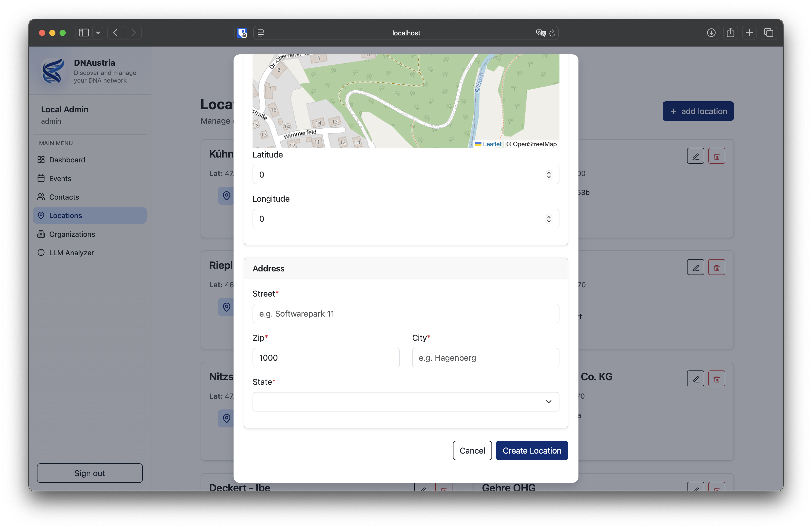

5. Click **Create Location** to save.

### 5.3 Edit / delete a location

- ✏️ opens the **Edit Location** popup. Title, map pin, coordinates, and address can all be changed.

  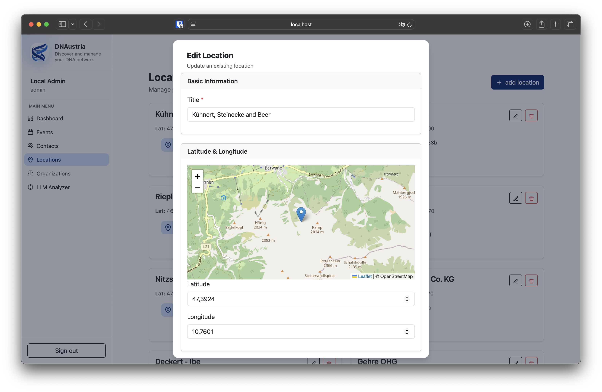
  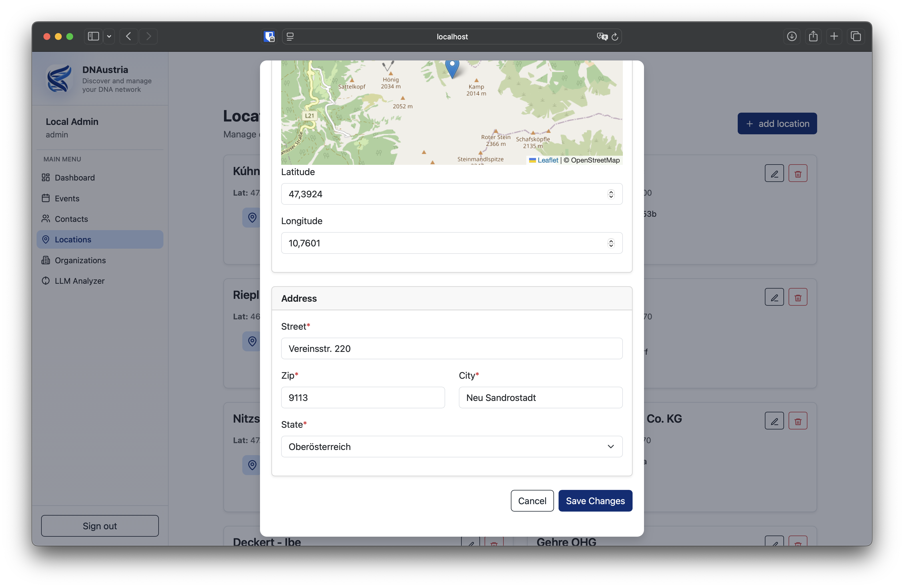

- 🗑️ removes the location after confirmation. **Caution:** locations that are still used by events should not be deleted.

---

## 6. Organizations

Organizations represent companies or institutions that act as partners or are linked to contacts.

### 6.1 Overview

Select **Organizations** in the menu. The card view shows the name and a short address (street, zip, city).

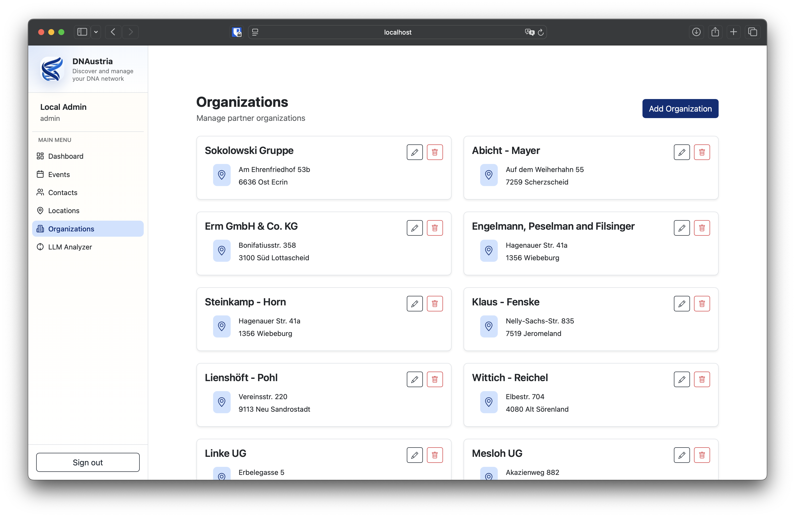

### 6.2 Create an organization

1. Click **Add Organization**.
2. **Organization Details:**
   - **Name** (required)
3. **Address** (optional, but recommended):
   - **Street** – street address
   - **ZIP Code** – postal code
   - **City** – city or town
4. Click **Create Organization** to save.

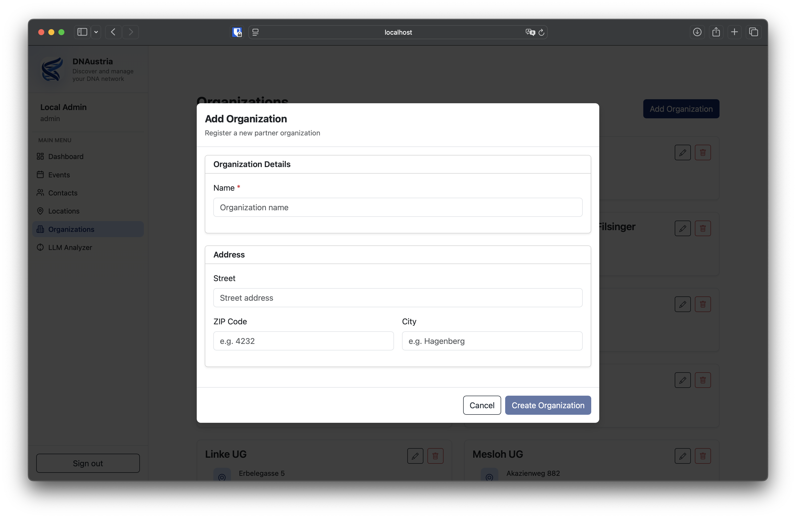

### 6.3 Edit / delete an organization

- ✏️ opens **Update Organization** – all fields can be changed; save with **Update Organization**.

  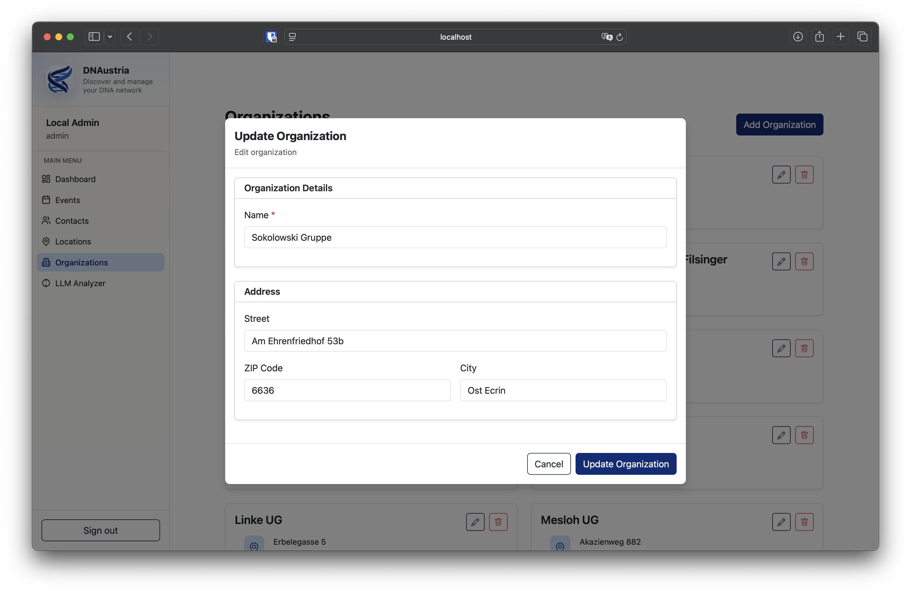

- 🗑️ deletes after confirmation. Existing contacts will lose their assignment to this organization.

---

## 7. How the modules work together

```
Organization  ──┐
                 ├──►  Contact   (a Contact is assigned to an Organization)
Location      ──┘            

Location  ──►  Event  ──►  Contact
```

Recommended order when setting up a new dataset:

1. First, create the **Organization** (if it does not exist yet).
2. Create a **Location** if a new address is needed.
3. Create the **Contact** and assign it to the organization.
4. Create the **Event** and link the location, organization, and contact.

---

## 8. Tips & notes

- **Validation:** required fields are marked with `*`; errors are shown in red below the field.
- **Deletion is permanent** – always read the confirmation prompt carefully.
- **Map pin (Locations):** the map is based on OpenStreetMap. Clicking on the map sets the pin and overwrites latitude/longitude.
- **Sign out** at the bottom-left ends the session.
